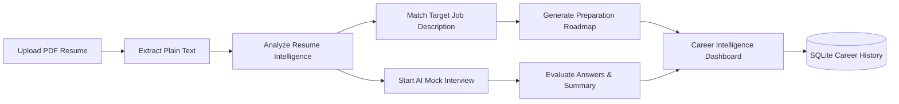
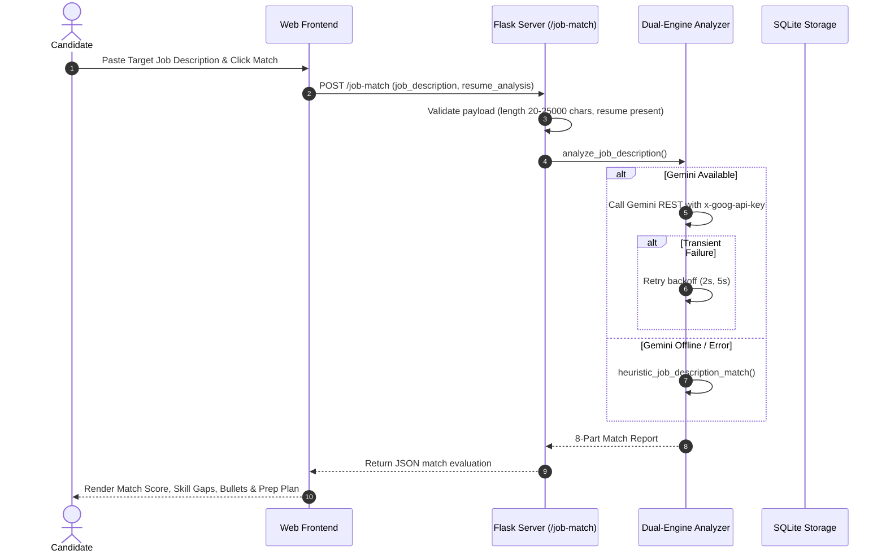

# CareerPilot AI — Intelligent AI Resume & Interview Coach

An intelligent, production-ready career acceleration and interview preparation web platform built with Python, Flask, SQLite, and Google Gemini Generative AI.

[](https://careerpilot-ai-m0wq.onrender.com)
[](https://github.com/Prakashitha22/CareerPilot-AI)
[](https://www.python.org/)
[](https://flask.palletsprojects.com/)
[](https://ai.google.dev/)
[](https://www.sqlite.org/)
[](tests/)
[](LICENSE)

---

## Live Demo

Experience the live application hosted on Render:
👉 **[https://careerpilot-ai-m0wq.onrender.com](https://careerpilot-ai-m0wq.onrender.com)**

---

## GitHub

Access the source code, issue tracker, and project repository:
👉 **[https://github.com/Prakashitha22/CareerPilot-AI](https://github.com/Prakashitha22/CareerPilot-AI)**

---

## Overview

CareerPilot AI bridges the critical gap between static resume screening and technical interview performance. Rather than treating resume drafting, job alignment, and mock interviews as disjointed steps, CareerPilot AI brings them together into an integrated, end-to-end preparation platform.

Job seekers can parse PDF resumes, extract multi-dimensional profile intelligence, benchmark their background against real job descriptions, practice with an adaptive AI interview coach, review dynamic career readiness metrics, and persist their progress across sessions—all within a fast, responsive glassmorphic interface.

The platform is engineered around a resilient **dual-engine design**: it harnesses **Google Gemini 3.6 Flash** via a secured REST integration with exponential-backoff retries for live AI synthesis, and automatically switches to a deterministic, high-precision offline heuristic engine whenever API keys are absent or external rate limits occur.

---

## Core Features

### AI Resume Intelligence
- **PDF Resume Parsing**: Handles multi-page documents up to 16 MB with text extraction via `pypdf`.
- **11-Dimensional Profile Breakdown**: Extracts Candidate Summary, Education, Technical Skills, Soft Skills, Work Experience, Projects, Certifications, Key Strengths, Skill Gaps, Top Suggested Roles, and Resume Improvement Tips.
- **One-Click Action Launchers**: Seamlessly launch tailored interview sessions or career intelligence reports based on suggested roles.

### Job Description Matcher
- **Targeted Compatibility Scoring**: Computes an objective 0–100 match score between candidate qualifications and target job postings.
- **Granular Skill & Experience Breakdown**: Highlights confirmed matching skills alongside critical missing competencies.
- **Tailored Resume & Interview Guidance**: Delivers concrete resume bullet optimizations, learning recommendations, role-specific interview questions, and a 5-step preparation plan.

### AI Interview Coach
- **5-Stage Structured Interviews**: Generates role-specific questions across Technical Fundamentals, System Architecture, Resume Project Deep-Dive, Debugging/Troubleshooting, and Behavioral (STAR) scenarios.
- **Real-Time Granular Scoring**: Scores answers on a 0.0–10.0 scale with technical accuracy, relevance, and clarity ratings.
- **Exemplary Model Answers**: Provides expandable 10/10 model answers and constructive critique for each response.
- **Session Performance Synthesis**: Aggregates average scores and assigns hiring tiers (*Solid Hire*, *Strong Hire*, *Developing*).

### Career Intelligence Dashboard
- **Calibrated Career Readiness**: Combines resume alignment (50%) and live interview performance (50%) into a unified readiness index.
- **Skill Gap Radar**: Visual comparison of current candidate capabilities versus industry benchmarks.
- **Multi-Role Suitability Matrix**: Match percentages across adjacent technical career tracks.
- **5-Step Chronological Learning Roadmap**: Phased milestones (Weeks 1 to 8+) guiding candidates from gap closure to portfolio development.
- **Portfolio Recommendations & ATS Checklist**: Curated capstone project ideas and actionable resume hygiene guidelines.

### Persistent Career History
- **Relational Storage**: Normalized SQLite schema saving candidates, resume analyses, interview transcripts, and career reports.
- **Session Continuity**: Retains candidate activity across browser sessions using anonymous session identifiers.
- **Interactive Feed & Filter Pills**: Chronological activity log with quick filtering (*All*, *Resume Analyses*, *Mock Interviews*, *Career Reports*), record inspection modals, and candidate-scoped history deletion.

---

## How It Works



1. **Upload & Parse**: The candidate uploads a PDF resume. The system parses multi-page plain text and computes document metrics.
2. **Profile Intelligence**: The candidate triggers resume analysis. The dual-engine extracts 11 structured dimensions and automatically persists the record.
3. **Job Alignment**: The candidate pastes a target job posting. The Job Description Matcher computes match scores, identifies missing skills, recommends resume revisions, and formulates interview questions.
4. **Mock Interview**: The candidate takes a 5-question mock interview, receiving real-time evaluation and 10/10 model answers.
5. **Career Synthesis**: The platform unifies resume qualification and interview performance into a career readiness score and a personalized 5-step learning roadmap.
6. **Persistence**: All activities are safely stored in SQLite for instant review and chronological history tracking.

---

## Architecture

```mermaid
graph TD
    subgraph Client Layer
        Browser[Modern Web Browser]
        UI[Glassmorphic Responsive UI]
        JS[Vanilla JavaScript Controllers]
    end

    subgraph Application Layer [Flask WSGI / Gunicorn]
        App[Flask Application Core (app.py)]
        HealthRoute[GET /health]
        UploadRoute[POST /upload]
        AnalyzeRoute[POST /analyze]
        JobMatchRoute[POST /job-match]
        InterviewRoutes[Interview Q&A Endpoints]
        HistoryRoutes[RESTful History Endpoints]
    end

    subgraph Intelligence Engine [Dual-Engine Controller (analyzer.py)]
        Router{GEMINI_API_KEY Available?}
        Gemini[Google Gemini 3.6 Flash REST API]
        Retry[Exponential Backoff Retry Logic]
        Heuristic[Smart Offline Heuristic Fallback]
    end

    subgraph Data Layer [Persistence Layer (database.py)]
        DB[(SQLite 3 Database: careerpilot.db)]
        T1[candidates]
        T2[resume_analyses]
        T3[interview_sessions]
        T4[career_reports]
    end

    Browser --> UI --> JS
    JS --> App
    App --> HealthRoute
    App --> UploadRoute
    App --> AnalyzeRoute
    App --> JobMatchRoute
    App --> InterviewRoutes
    App --> HistoryRoutes
    AnalyzeRoute --> Router
    JobMatchRoute --> Router
    InterviewRoutes --> Router
    Router -- Yes --> Gemini
    Gemini -- Temporary Error (429/503/5xx) --> Retry
    Retry -- Retries Exhausted --> Heuristic
    Router -- No --> Heuristic
    App --> DB
    DB --- T1 & T2 & T3 & T4
```

---

## Dual-Engine AI Design

CareerPilot AI uses a dual-engine pattern to ensure high-quality generative intelligence when cloud AI is available, without sacrificing uptime when it is not.

| Capability | Primary Engine (Google Gemini 3.6 Flash) | Fallback Engine (Deterministic Heuristic) |
|---|---|---|
| **Trigger** | `GEMINI_API_KEY` configured and API reachable | API key missing, network unavailable, or rate-limited |
| **API Protocol** | Google REST API (`x-goog-api-key` header) | Zero external calls; pure local Python processing |
| **Retry Strategy** | 3 attempts with exponential backoff on HTTP 429/500/502/503/504 | Instantaneous execution with zero external dependencies |
| **Resume Analysis** | Deep generative semantic parsing across 11 fields | Regex tokenizer scanning 50+ technology stacks |
| **Job Description Matcher**| Nuanced contextual evaluation, skill extraction, and tailored bullet edits | Heuristic keyword density and overlap scoring |
| **Interview Generator** | Role-tailored questions contextualized by resume projects | Curated question banks for top technical roles + generator |
| **Answer Evaluation** | Multi-attribute scoring (0.0–10.0) with model answers | Heuristic length, clarity, and keyword-weighted scoring |
| **Database Persistence** | Saved automatically to `careerpilot.db` | Saved automatically to `careerpilot.db` |
| **User Experience** | Real-time AI badge indicator | Clear offline badge indicator; zero server crashes |

---

## Reliability & Security

- **Server-Side API Key Handling**: The `GEMINI_API_KEY` is loaded strictly on the server side via environment variables. It is never exposed in client templates, scripts, or responses.
- **Header Authentication (`x-goog-api-key`)**: REST requests pass the API key exclusively via HTTP request headers. Query parameters (`?key=...`) are prohibited, ensuring keys never leak in URLs or browser history.
- **Smart Retry & Exponential Backoff**: Temporary server errors (`HTTP 429`, `500`, `502`, `503`, `504`) trigger up to 3 attempts with exponential backoff (2 seconds, then 5 seconds). Permanent client errors (`HTTP 400`, `401`, `403`, `404`) fail fast without unnecessary retries.
- **Sensitive Log Redaction**: Server logging routines strip credentials, secret keys, and query parameters before writing diagnostic errors to standard error.
- **Deterministic Offline Fallback**: If all retry attempts fail or network access is unavailable, the application gracefully degrades to local heuristic processing.
- **SQL Injection Prevention**: Database queries use parameterized SQL statements (`?`) across all table operations.
- **Upload Validation & Path Traversal Defense**: File uploads are restricted to `.pdf` format, sanitized with `secure_filename()`, validated for directory boundary containment, and enforced at a 16 MB maximum payload limit.
- **Production Health Monitoring**: An unauthenticated `GET /health` endpoint returns JSON health status (`{"status": "ok", "service": "CareerPilot AI"}`) for cloud load balancers and uptime pingers.

---

## Job Description Matcher Details

The Job Description Matcher compares an analyzed candidate resume against any target job posting through the `POST /job-match` endpoint.



### Generated Report Attributes
1. **Resume vs Job Description Comparison**: Contextual comparison of candidate profile against job responsibilities.
2. **0–100 Match Score**: Quantitative compatibility percentage with hiring tier categorization (*High Match*, *Moderate Match*, *Developing Match*).
3. **Matching Skills**: Specific technical, framework, and domain skills confirmed on both sides.
4. **Missing Skills**: Priority technologies and qualifications required by the job but absent from the resume.
5. **Relevant Resume Strengths**: Highlighted candidate experiences that directly reinforce the target role.
6. **Resume Improvement Suggestions**: Targeted revisions and keyword optimizations to enhance ATS screening performance.
7. **Learning Recommendations**: Specific tools, frameworks, and concepts to study to bridge identified gaps.
8. **Job-Specific Interview Questions**: Anticipated technical and situational interview questions drawn directly from the job description.
9. **5-Step Preparation Plan**: Phased action checklist guiding the candidate through resume tuning, concept mastery, project building, interview practice, and final application submission.
10. **Dual-Engine Execution**: Backed by live Google Gemini 3.6 Flash analysis with automatic fallback to local heuristic matching.

---

## Tech Stack

| Layer | Technology | Purpose |
|---|---|---|
| **Backend Framework** | Python 3.10+ / Flask 3.0+ | WSGI application core, API routing, and controller logic |
| **WSGI Server** | Gunicorn 21.2+ | Production multi-worker WSGI HTTP server |
| **Generative AI** | Google Gemini 3.6 Flash | LLM inference via REST API with `x-goog-api-key` header auth |
| **Document Parsing** | pypdf 4.0+ | Multi-page PDF plain text extraction and validation |
| **Database** | SQLite 3 | Relational persistence with parameterized ACID transactions |
| **Frontend** | Semantic HTML5, CSS3, Vanilla JS | Modern glassmorphic interface, responsive layout, zero framework bloat |
| **Testing** | Python `unittest` | Native standard library test framework with 49 automated tests |

---

## Project Structure

```text
CareerPilot-AI/
├── .env.example              # Environment variables template
├── .gitignore                # Protects secrets, databases, uploads, and caches
├── .python-version           # Pinned Python version (3.11.9) for buildpacks
├── LICENSE                   # MIT Open-Source License
├── README.md                 # Product documentation and technical reference
├── analyzer.py               # Dual-engine controller: Gemini REST API + Heuristic analyzer
├── app.py                    # Flask application core, routes, WSGI entrypoint, API handlers
├── database.py               # SQLite schema, parameterized CRUD, session management
├── requirements.txt          # Production dependency manifest
├── walkthrough.md            # Comprehensive development walkthrough and milestones
├── static/
│   ├── favicon.svg           # Application SVG brand icon
│   └── style.css             # Glassmorphic stylesheet, CSS tokens, responsive rules
├── templates/
│   └── index.html            # Single-page application interface and modals
├── tests/
│   ├── __init__.py           # Test package initializer
│   └── test_app.py           # Complete test suite containing 49 automated tests
└── uploads/                  # Temporary upload directory (auto-created, git-ignored)
```

---

## Local Setup

### Prerequisites
- Python 3.10 or higher
- Git
- *(Optional)* Google Gemini API Key from [Google AI Studio](https://aistudio.google.com/)

### 1. Clone the Repository
```bash
git clone https://github.com/Prakashitha22/CareerPilot-AI.git
cd CareerPilot-AI
```

### 2. Set Up a Virtual Environment
```bash
# Windows
python -m venv venv
venv\Scripts\activate

# macOS / Linux
python3 -m venv venv
source venv/bin/activate
```

### 3. Install Dependencies
```bash
pip install -r requirements.txt
```

### 4. Configure Environment Variables
```bash
cp .env.example .env
```
Populate `.env` with your settings (see [Environment Variables](#environment-variables)).

### 5. Run the Application
```bash
# Windows
py app.py

# macOS / Linux
python3 app.py
```
Open your browser at:
```text
http://127.0.0.1:5000
```

---

## Environment Variables

| Variable | Required | Default | Description |
|---|---|---|---|
| `GEMINI_API_KEY` | Optional | *(None)* | Google AI Studio API key. If omitted, the offline heuristic engine is used. |
| `GEMINI_MODEL` | Optional | `gemini-3.6-flash` | Gemini model endpoint identifier. |
| `FLASK_SECRET_KEY` | Recommended | Built-in fallback | Secret key used by Flask to cryptographically sign session cookies. |
| `FLASK_DEBUG` | Optional | `false` | Enables Flask debug mode for local development. |
| `PORT` | Optional | `5000` | Port for dynamic binding on cloud hosting environments. |

---

## Testing

The project includes an automated test suite containing **49 automated tests** located in `tests/test_app.py`.

### Running the Full Test Suite
```bash
# Windows
py -m unittest discover -s tests -v

# macOS / Linux
python3 -m unittest discover -s tests -v
```

### Test Suite Breakdown (49 Passing Tests)
- **Upload & PDF Ingestion (5 tests)**: Route accessibility, multi-page parsing, missing file redirection, empty filename validation, invalid extension rejection, and corrupted PDF error handling.
- **AI Resume Intelligence (2 tests)**: Empty payload validation and 11-dimension candidate intelligence schema extraction.
- **Job Description Matcher (6 tests)**: Homepage UI integration, empty description validation, oversized payload rejection, missing resume prerequisite validation, live Gemini report generation, offline heuristic matching, and graceful fallback.
- **AI Interview Coach (7 tests)**: 5-question generation, per-question evaluation, empty answer handling, performance summary aggregation, header authentication validation, and offline fallback.
- **Career Intelligence (2 tests)**: Combined 50/50 readiness calculation and resume-only readiness fallback.
- **SQLite Persistence (8 tests)**: Schema initialization, candidate CRUD, resume analysis saving/retrieval, interview saving/retrieval, career report saving/retrieval, history aggregation/clear, REST history API, and end-to-end auto-persistence.
- **Gemini REST, Security & Retry Handling (16 tests)**: Model identifier configuration, endpoint URL and `x-goog-api-key` header formation, sensitive URL redaction, diagnostic logging, diagnostic payload isolation, single execution on HTTP 200, retry on HTTP 503 succeeding on attempt 2, retry exhaustion on persistent 503, fast failure on HTTP 400/401/403, credential exclusion from stderr logs, and offline fallback guarantees.
- **Deployment & Production Readiness (3 tests)**: Health check endpoint verification, Gunicorn WSGI callable validation, and dynamic `$PORT` environment variable binding.

---

## Deployment

CareerPilot AI is configured for automated cloud deployment on **Render**, **Railway**, or containerized hosts.

### Render Configuration
1. Connect your GitHub repository to Render.
2. Select **Web Service** with the **Python** environment.
3. Configure build and startup commands:
   - **Build Command**: `pip install -r requirements.txt`
   - **Start Command**: `gunicorn app:app`
   - **Health Check Path**: `/health`
4. Set environment variables in the Render dashboard:
   - `GEMINI_API_KEY`: Your Google AI Studio API key *(Optional)*
   - `GEMINI_MODEL`: `gemini-3.6-flash`
   - `FLASK_SECRET_KEY`: A cryptographically secure random string
   - `PYTHON_VERSION`: `3.11.9`

---

## Limitations

- **Ephemeral Cloud Storage**: On free-tier cloud platforms (e.g. Render free tier), instances run on ephemeral filesystems. The local SQLite database resets upon instance spin-down or redeployment.
- **Synchronous LLM Calls**: Large generative requests currently run synchronously on request threads; high-concurrency environments would benefit from an asynchronous background task queue.
- **Text-Only PDF Extraction**: Complex graphical resumes, multi-column tables, or scanned image PDFs without selectable text are subject to OCR limitations.

---

## Future Improvements

- [ ] **Managed Cloud Database**: Add PostgreSQL connection support for persistent multi-user storage in cloud deployments.
- [ ] **Voice Mock Interviews**: Integrate the Web Speech API for verbal question delivery and spoken answer transcription.
- [ ] **Exportable PDF Reports**: Allow candidates to download a formatted PDF career audit report containing their readiness score, skill gaps, and learning roadmap.
- [ ] **Asynchronous Task Queue**: Introduce Celery or Redis Queue for non-blocking background analysis of large documents.
- [ ] **OAuth Authentication**: Provide optional GitHub and Google single sign-on for cross-device history synchronization.

---

## License

This project is licensed under the **MIT License** — see the [LICENSE](LICENSE) file for details.
