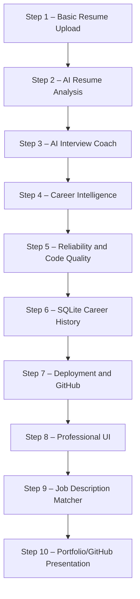
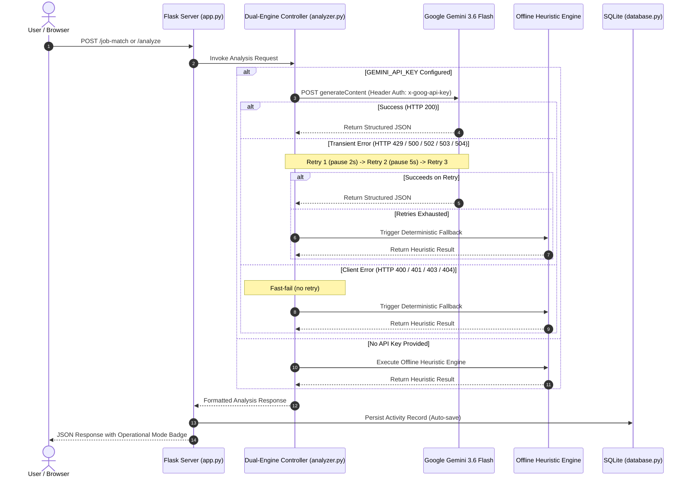

# CareerPilot AI — Development Walkthrough & Engineering Milestones

CareerPilot AI is an intelligent, production-ready career development platform built with Python, Flask, SQLite, and Google Gemini Generative AI. This document records the architectural progression, engineering milestones, and automated verification across the project lifecycle.

---

## Engineering Milestones



### Step 1 – Basic Resume Upload
- Engineered a secure file ingestion pipeline supporting PDF resumes up to 16 MB.
- Extracted multi-page plain text using `pypdf` with error handling for malformed or corrupted documents.
- Implemented file extension whitelisting (`.pdf`), MIME verification, and path traversal protection with `secure_filename`.
- Built real-time preview counters reporting extracted character and word statistics.

### Step 2 – AI Resume Analysis
- Integrated **Google Gemini 3.6 Flash** via REST API to perform multi-dimensional resume parsing.
- Established an 11-dimension candidate profile schema: Profile Summary, Education, Technical Skills, Soft Skills, Work Experience, Projects, Certifications, Key Strengths, Missing Skills, Top 3 Suggested Roles, and Resume Improvement Tips.
- Built a high-precision regex heuristic fallback engine to guarantee deterministic analysis when external APIs are unavailable.
- Standardized REST calls via `generativelanguage.googleapis.com` with `x-goog-api-key` HTTP header authentication.

### Step 3 – AI Interview Coach
- Developed an interactive 5-stage technical and behavioral mock interview coach:
  1. Technical Fundamentals
  2. System Architecture & Design
  3. Resume & Project Experience Deep-Dive
  4. Real-World Debugging & Troubleshooting
  5. Behavioral Collaboration (STAR Framework)
- Created granular scoring (0.0 to 10.0) evaluating technical accuracy, relevance, and clarity.
- Delivered constructive feedback alongside expandable **10/10 Model Answers** for each question.
- Implemented aggregate session performance reporting with hiring tier assignment (*Solid Hire*, *Strong Hire*, *Developing*).

### Step 4 – Career Intelligence
- Combined resume alignment (50%) and live mock interview execution (50%) into a unified **Career Readiness Score**.
- Built a visual skill gap indicator comparing present candidate skills with industry benchmarks.
- Generated a multi-role suitability matrix mapping transferable skills across adjacent career paths.
- Built a chronological 5-step learning roadmap (Weeks 1 to 8+) and recommended 3 domain-specific capstone portfolio projects.

### Step 5 – Reliability and Code Quality
- Implemented robust error isolation across all analysis and extraction routes to prevent unhandled 500 crashes.
- Added automated retry logic with exponential backoff for temporary Google Gemini failures (`HTTP 429`, `500`, `502`, `503`, `504`) with a maximum of 3 attempts.
- Enforced immediate fast-fail behavior for permanent client errors (`HTTP 400`, `401`, `403`, `404`).
- Implemented server-side secret sanitization to guarantee API keys and sensitive URLs never leak in error logs, headers, or client payloads.

### Step 6 – SQLite Career History
- Integrated a zero-configuration SQLite database (`careerpilot.db`) with 4 relational tables:
  - `candidates`: Anonymous session IDs, candidate names, creation timestamps.
  - `resume_analyses`: Extracted raw text, 11 structured analysis fields, creation timestamps.
  - `interview_sessions`: Target roles, average scores, hiring tiers, full Q&A transcripts.
  - `career_reports`: Career readiness scores, skill gaps, role matches, learning roadmaps.
- Enforced parameterized queries (`?`) across all SQL operations to prevent SQL injection.
- Added non-blocking auto-persistence on the completion of each analysis, interview, and career report.
- Developed the Career History dashboard with filter pills (*All*, *Resume Analyses*, *Mock Interviews*, *Career Reports*), record inspection modals, and candidate-scoped history deletion.

### Step 7 – Deployment and GitHub
- Prepared the application for cloud deployment using the Gunicorn production WSGI server (`gunicorn app:app`).
- Implemented dynamic `$PORT` environment variable binding for cloud PaaS providers (Render, Railway).
- Added an unauthenticated health check endpoint at `GET /health` (`{"status": "ok", "service": "CareerPilot AI"}`).
- Pinned runtime version with `.python-version` (3.11.9) and created `.env.example` templates.
- Connected the project to GitHub and established live continuous deployment on Render at `https://careerpilot-ai-m0wq.onrender.com`.

### Step 8 – Professional UI
- Transitioned the entire web interface into a responsive glassmorphic design system with dark theme tokens.
- Replaced internal development progress trackers with clean, user-focused navigation and feature badging.
- Improved accessibility, loading spinners, mobile responsiveness, and score visualization meters.

### Step 9 – Job Description Matcher
- Developed the Job Description Matcher feature allowing candidates to benchmark their resume against any target job posting.
- Added `POST /job-match` supporting both live Gemini 3.6 Flash analysis and offline heuristic matching.
- Generates an 8-part report:
  1. Match Score (0% to 100%) with hiring tier categorization
  2. Overall Role Fit Summary
  3. Matching Skills
  4. Critical Missing Skills
  5. Relevant Resume Strengths
  6. Recommended Resume Bullet Adjustments (Action Verb + Quantifiable Metric format)
  7. Learning Recommendations
  8. Job-Specific Interview Questions and a 5-Step Preparation Plan
- Expanded automated unit test suite from 42 to 49 passing tests.

### Step 10 – Portfolio/GitHub Presentation
- Completely modernized `README.md` and `walkthrough.md` to reflect production-grade software engineering standards.
- Removed all legacy developmental and temporary project framing.
- Integrated accurate architectural Mermaid diagrams, quick links to live demo, and API reference documentation.
- Validated all 49 automated unit tests passing across all components.

---

## Dual-Engine Sequence Architecture



---

## Automated Test Suite Verification

The automated test suite runs via Python standard library `unittest` without external test runner dependencies.

### Command Execution
```bash
py -m unittest discover -s tests -v
```

### Full Test Verification Output (49 Tests Passing)
```text
test_404_handler (test_app.CareerPilotTestCase.test_404_handler) ... ok
test_analyze_empty_text (test_app.CareerPilotTestCase.test_analyze_empty_text) ... ok
test_analyze_resume_diagnostic_fallback (test_app.CareerPilotTestCase.test_analyze_resume_diagnostic_fallback) ... ok
test_analyze_valid_resume (test_app.CareerPilotTestCase.test_analyze_valid_resume) ... ok
test_api_history_routes (test_app.CareerPilotTestCase.test_api_history_routes) ... ok
test_candidate_crud (test_app.CareerPilotTestCase.test_candidate_crud) ... ok
test_candidate_history_aggregation_and_clear (test_app.CareerPilotTestCase.test_candidate_history_aggregation_and_clear) ... ok
test_career_intelligence_resume_only (test_app.CareerPilotTestCase.test_career_intelligence_resume_only) ... ok
test_career_intelligence_with_interview (test_app.CareerPilotTestCase.test_career_intelligence_with_interview) ... ok
test_database_initialization (test_app.CareerPilotTestCase.test_database_initialization) ... ok
test_end_to_end_auto_persistence (test_app.CareerPilotTestCase.test_end_to_end_auto_persistence) ... ok
test_gemini_400_should_not_retry (test_app.CareerPilotTestCase.test_gemini_400_should_not_retry) ... ok
test_gemini_401_should_not_retry (test_app.CareerPilotTestCase.test_gemini_401_should_not_retry) ... ok
test_gemini_403_should_not_retry (test_app.CareerPilotTestCase.test_gemini_403_should_not_retry) ... ok
test_gemini_api_key_never_appears_in_logs (test_app.CareerPilotTestCase.test_gemini_api_key_never_appears_in_logs) ... ok
test_gemini_endpoint_and_headers_structure (test_app.CareerPilotTestCase.test_gemini_endpoint_and_headers_structure) ... ok
test_gemini_model_configuration (test_app.CareerPilotTestCase.test_gemini_model_configuration) ... ok
test_gemini_retry_503_exhausted_fallback (test_app.CareerPilotTestCase.test_gemini_retry_503_exhausted_fallback) ... ok
test_gemini_retry_on_503_then_success (test_app.CareerPilotTestCase.test_gemini_retry_on_503_then_success) ... ok
test_gemini_retry_successful_first_attempt (test_app.CareerPilotTestCase.test_gemini_retry_successful_first_attempt) ... ok
test_health_endpoint (test_app.CareerPilotTestCase.test_health_endpoint) ... ok
test_homepage_has_job_matcher (test_app.CareerPilotTestCase.test_homepage_has_job_matcher) ... ok
test_homepage_loads (test_app.CareerPilotTestCase.test_homepage_loads) ... ok
test_interview_evaluate (test_app.CareerPilotTestCase.test_interview_evaluate) ... ok
test_interview_evaluate_empty_answer (test_app.CareerPilotTestCase.test_interview_evaluate_empty_answer) ... ok
test_interview_features_use_header_auth_and_no_key_in_url (test_app.CareerPilotTestCase.test_interview_features_use_header_auth_and_no_key_in_url) ... ok
test_interview_gemini_failure_fallback (test_app.CareerPilotTestCase.test_interview_gemini_failure_fallback) ... ok
test_interview_start (test_app.CareerPilotTestCase.test_interview_start) ... ok
test_interview_summary (test_app.CareerPilotTestCase.test_interview_summary) ... ok
test_job_match_empty_description (test_app.CareerPilotTestCase.test_job_match_empty_description) ... ok
test_job_match_gemini_failure_graceful_fallback (test_app.CareerPilotTestCase.test_job_match_gemini_failure_graceful_fallback) ... ok
test_job_match_gemini_success (test_app.CareerPilotTestCase.test_job_match_gemini_success) ... ok
test_job_match_heuristic_offline_success (test_app.CareerPilotTestCase.test_job_match_heuristic_offline_success) ... ok
test_job_match_missing_resume_analysis (test_app.CareerPilotTestCase.test_job_match_missing_resume_analysis) ... ok
test_job_match_oversized_description (test_app.CareerPilotTestCase.test_job_match_oversized_description) ... ok
test_log_gemini_diagnostic (test_app.CareerPilotTestCase.test_log_gemini_diagnostic) ... ok
test_offline_fallback_guarantee (test_app.CareerPilotTestCase.test_offline_fallback_guarantee) ... ok
test_port_configuration_logic (test_app.CareerPilotTestCase.test_port_configuration_logic) ... ok
test_production_startup_configuration (test_app.CareerPilotTestCase.test_production_startup_configuration) ... ok
test_sanitize_gemini_message (test_app.CareerPilotTestCase.test_sanitize_gemini_message) ... ok
test_save_and_retrieve_career_report (test_app.CareerPilotTestCase.test_save_and_retrieve_career_report) ... ok
test_save_and_retrieve_interview_session (test_app.CareerPilotTestCase.test_save_and_retrieve_interview_session) ... ok
test_save_and_retrieve_resume_analysis (test_app.CareerPilotTestCase.test_save_and_retrieve_resume_analysis) ... ok
test_upload_corrupted_pdf (test_app.CareerPilotTestCase.test_upload_corrupted_pdf) ... ok
test_upload_empty_filename (test_app.CareerPilotTestCase.test_upload_empty_filename) ... ok
test_upload_invalid_extension (test_app.CareerPilotTestCase.test_upload_invalid_extension) ... ok
test_upload_no_file (test_app.CareerPilotTestCase.test_upload_no_file) ... ok
test_upload_valid_pdf (test_app.CareerPilotTestCase.test_upload_valid_pdf) ... ok

----------------------------------------------------------------------
Ran 49 tests in 0.634s

OK
```

---

## Active Endpoints Reference

| Route | HTTP Method | Auth / Access | Purpose |
|---|---|---|---|
| `/` | `GET` | Public | Main single-page web interface |
| `/health` | `GET` | Public | Cloud health check and monitoring |
| `/upload` | `POST` | Public | PDF resume parsing and text extraction |
| `/analyze` | `POST` | Public | 11-dimension candidate analysis |
| `/job-match` | `POST` | Public | 8-part job description match analysis |
| `/interview/start` | `POST` | Public | 5-question interview question generator |
| `/interview/evaluate` | `POST` | Public | Per-question evaluation and model answers |
| `/interview/summary` | `POST` | Public | Overall interview session performance synthesis |
| `/career-intelligence` | `POST` | Public | Career readiness score and learning roadmap |
| `/api/history` | `GET` | Session-scoped | Combined chronological activity history |
| `/api/history/<type>/<id>`| `GET` | Session-scoped | Detailed JSON record viewer |
| `/api/history/clear` | `POST` | Session-scoped | Candidate-scoped activity history reset |

---

## Verification & Integrity Checklist

- [x] All 49 automated unit tests passing (`0.634s`).
- [x] Professional software product positioning with zero legacy framing.
- [x] Step 9 Job Description Matcher fully documented.
- [x] Dual-engine architecture and safe retry mechanism accurately detailed.
- [x] Live Demo (`https://careerpilot-ai-m0wq.onrender.com`) and GitHub repo verified.
- [x] Zero hardcoded API keys or environment secrets present.
